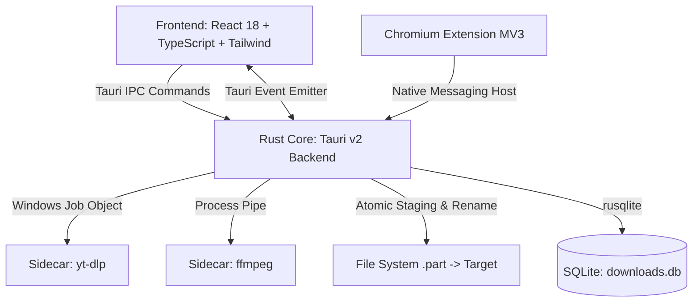

# Devizee Lite — Universal Video Downloader & Multimedia Hub

<div align="center">


**A high-performance, privacy-first desktop multimedia download manager and playback hub.**  
Built with **Tauri v2**, **Rust**, **React 18**, and **TypeScript**. Powered by `yt-dlp` and `ffmpeg`.

[](https://tauri.app/)
[](https://www.rust-lang.org/)
[](https://react.dev/)
[](https://www.typescriptlang.org/)
[](https://tailwindcss.com/)
[](https://sqlite.org/)
[](#privacy--security-nfr-6-nfr-7)

</div>

---

## ⚡ Overview

**Devizee Lite** is a fast, modern desktop application designed to replace clunky browser downloaders and command-line wrappers with a unified, native desktop experience. It pairs a safe, lightweight Rust backend with an ultra-responsive React interface, delivering seamless video/audio fetching, library management, and in-app multimedia streaming.

### 🌟 Key Highlights

- **Universal Stream Extraction**: One-click analysis and download for YouTube, Vimeo, TikTok, Instagram, Twitter/X, SoundCloud, and 1,000+ platforms via sidecar `yt-dlp`.
- **Integrated Multimedia Player**: Full-screen video player with a Netflix-style side-drawer queue, scrubbing, volume control, and full keyboard navigation.
- **Hardware Audio Output Routing**: Switch between physical speakers, USB DACs, and wireless headphones on the fly without restarting playback.
- **Audio Equalizer Profiles**: Studio-tuned 8-band presets (Flat, Bass Boost, Vocal Booster, Electronic, Rock, Pop, Acoustic, Treble) accessible directly from the sidebar.
- **Physics-Driven Waveforms**: Hardware-accelerated canvas waveform visualizers with 0% idle CPU overhead.
- **Bulletproof Process Isolation**: Child processes (`yt-dlp` and `ffmpeg`) are bound to Windows Job Objects—zero orphaned background processes when cancelling or quitting.
- **Batch & Playlist Power**: Bulk URL parsing, channel/playlist queueing, and independent per-item resolution overrides.
- **Zero Telemetry**: Devizee connects strictly to media sources and official binary update releases. No analytics, tracking, or proxy intermediaries.

---

## 🏗️ Architecture



- **Backend (`src-tauri/`)**: Asynchronous Rust runtime powered by Tokio. Handles child process orchestration, stdout progress stream parsing, OS notifications, hardware audio sinks, and SQLite database persistence.
- **Frontend (`src/`)**: Functional TypeScript components with clean design-system tokens, high-performance canvas visualizers, and state-driven queue management.
- **Sidecar Lifecycle**: Sidecar binaries live isolated under `src-tauri/bin/`. Active self-updating binaries reside safely in `%LOCALAPPDATA%`, preserving runtime integrity without requiring Administrator privileges.

---

## 🎯 Features

### 1. Dashboard & Smart Stream Grabber
- **Instant Analysis**: Analyzes links automatically upon pasting or clicking the paste icon.
- **Multi-Quality Selector**: Instant switching between 4K UHD, 1080p FHD, 720p HD, 480p, 360p, or high-bitrate audio formats (MP3 320k, M4A, WAV, FLAC, OPUS).
- **Inline Audio Preview**: Audio preview with Data Saver mode to preview tracks before committing to full download.
- **Clip-Before-Download**: Visual start/end time trimming to extract only the necessary segment directly from the stream.

### 2. Batch & Playlist Processor
- Multi-URL parser to queue dozen of links concurrently.
- Playlist item inspection with "Select All / Invert / Deselect" controls.
- Independent format overrides for each playlist or batch entry.

### 3. Multimedia Hub & Built-In Player
- Dedicated tab for your local media library with instant filtering (Videos, Audio, Formats, Search).
- **Player Controls**:
  - Fullscreen mode (`F` or double-click)
  - Netflix-style collapsible Upcoming Queue drawer
  - Scrub bar with live hover timestamp
  - Hardware device selector (Speaker / Headphones / AirPlay / Bluetooth)
  - Sidebar Audio Equalizer selector with instant profile switching
  - Continuous playback, shuffle, and repeat (Single / All / Off)

### 4. Robust Download Queue & History
- Multi-state tracking: `Queued`, `Downloading`, `Processing`, `Paused`, `Completed`, `Interrupted`, `Cancelled`.
- Atomic download pipeline: files download with a temporary `.part` extension and rename only after integrity and duration validation passes.
- Desktop context menu: Open file location, copy original link, retry, or delete directly from disk.

---

## ⌨️ Keyboard Shortcuts (Multimedia Hub)

| Key | Action |
| :--- | :--- |
| `Space` | Toggle Play / Pause |
| `←` / `→` | Seek backward / forward by 10 seconds |
| `Ctrl + ←` / `Ctrl + →` | Seek backward / forward by 60 seconds (1 minute) |
| `↑` / `↓` | Increase / decrease volume by 5% |
| `M` | Toggle Mute |
| `F` | Toggle Fullscreen (Video) |
| `Esc` | Exit Fullscreen |

---

## 🛠️ Prerequisites & Setup

### Requirements
- **Node.js**: v18.0.0 or later
- **Rust**: 1.78.0 or later with `cargo` and MSVC toolchain
- **OS**: Windows 10/11 (x64)

### Clone & Install
```bash
git clone https://github.com/Touseeef/devizee-all-in-one-download-manager.git
cd devizee-all-in-one-download-manager

# Install frontend dependencies
npm install
```

### Sidecar Binaries Setup
Place the target-triple binaries in `src-tauri/bin/`:
- `yt-dlp-x86_64-pc-windows-msvc.exe`
- `ffmpeg-x86_64-pc-windows-msvc.exe`

### Run in Development
```bash
npm run tauri dev
```

### Build for Production
```bash
npm run tauri build
```

---

## 🔒 Privacy & Security (NFR-6, NFR-7)

Devizee is engineered from the ground up to respect user autonomy:
1. **Zero Telemetry**: No Google Analytics, Sentry, Mixpanel, or third-party telemetry beacons.
2. **Direct Socket Connections**: Media is streamed and downloaded directly from the content server to your local disk—never routed through intermediary cloud proxy servers.
3. **Local Database Storage**: All download logs, favorites, and settings are saved locally in SQLite (`downloads.db`) on your machine.

---

## 📄 License

Devizee is licensed under the [MIT License](LICENSE).
